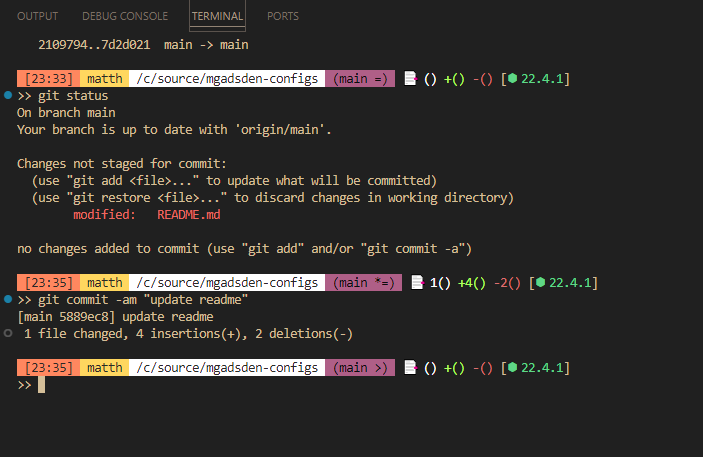
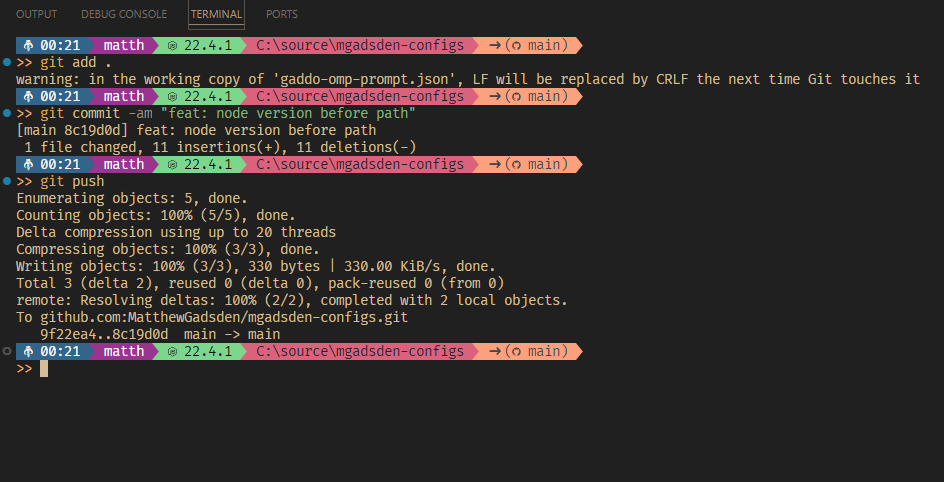
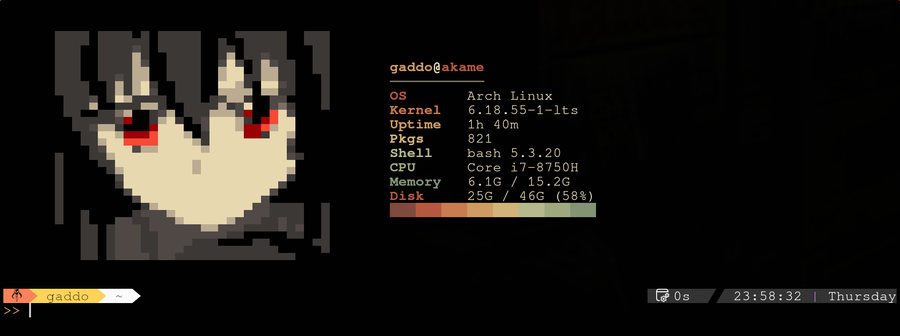
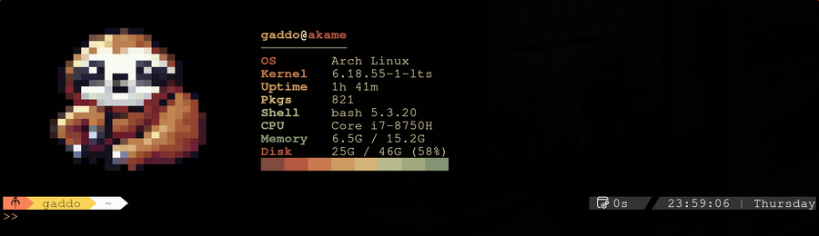

<h1 align="center">
	⚒ mgadsden-configs
</h1>

## Screenshots
<h3 align="center">
	Git Bash Profile
</h3>
<div align="center">
	
</div>

<h3 align="center">
	Oh-My-Posh Profile
</h3>
<div align="center">
	
</div>

<h3 align="center">
	Terminal Greeting
</h3>
<div align="center">
	
</div>

## Themes
### tokyo-snow
A terminal palette sampled from a snowy Tokyo alley wallpaper: warm vending-machine lights fading into green-tinted snow.

| Name  | Hex       | Name  | Hex       |
|-------|-----------|-------|-----------|
| brick | `#824a3e` | sage  | `#b9bc8f` |
| neon  | `#b85940` | moss  | `#a2aa7f` |
| ember | `#cb7d50` | pine  | `#849675` |
| amber | `#d19e63` | snow  | `#ebe0b3` |
| gold  | `#d5b67b` | dim   | `#797562` |

Copy `tokyo-snow.theme` to `~/.config/` and `source` it from bash to get a `c_<name>` ANSI escape for each colour (plus `c_text`, `c_muted`, `c_bold` and `c_reset`).

## Terminal Greeting
A startup banner for bash: pixel art on the left, system info (OS, kernel, uptime, packages, shell, CPU, memory, disk) on the right, coloured with the `tokyo-snow` theme.

| Art file            | Style                                            |
|---------------------|--------------------------------------------------|
| `akame-poster.ans`  | Akame, posterized cel-shaded blocks (default)    |
| `akame-color.ans`   | Akame, full-colour blocks                        |
| `akame-outline.ans` | Akame, ASCII line art with red eyes              |
| `sloth.ans`         | Pixel-art sloth                                  |

<details>
<summary>Other art styles</summary>

<h4 align="center">sloth.ans</h4>
<div align="center">
	
</div>
</details>

### Install
```bash
cp tokyo-snow.theme terminal-greeting/*.ans terminal-greeting/sloth-greeting.sh ~/.config/
echo '[[ -f ~/.config/sloth-greeting.sh ]] && bash ~/.config/sloth-greeting.sh' >> ~/.bashrc
```

To switch art, change `sloth_file=` at the top of `sloth-greeting.sh`. The package count uses `pacman`, so it's Arch-specific; the art needs a terminal with 24-bit colour (e.g. kitty).
